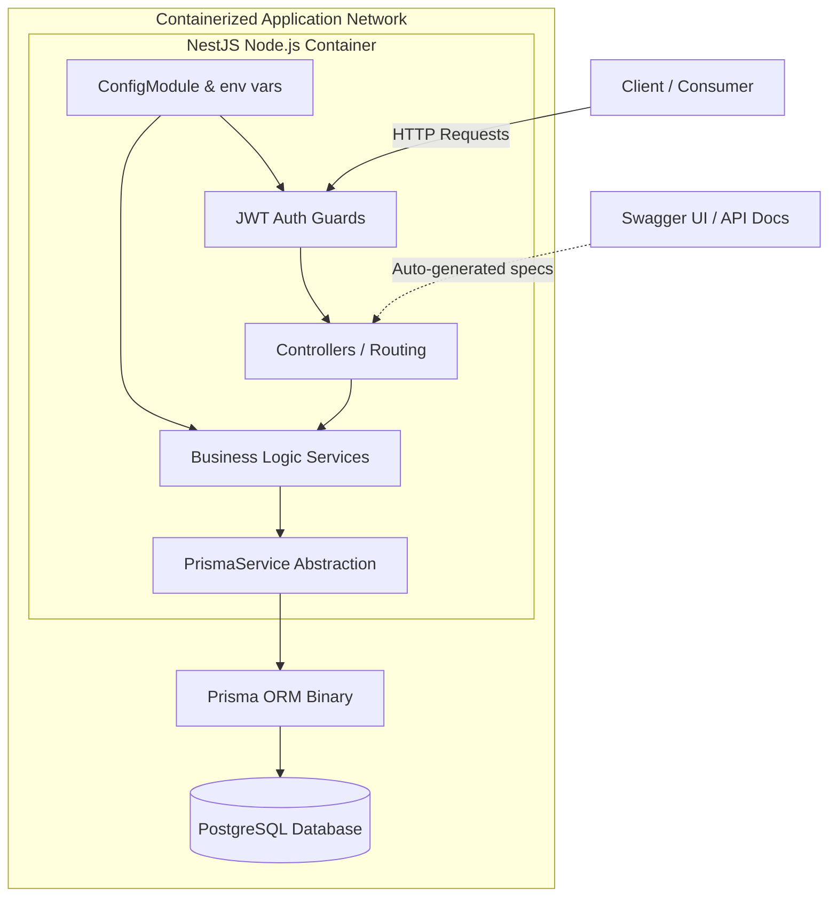
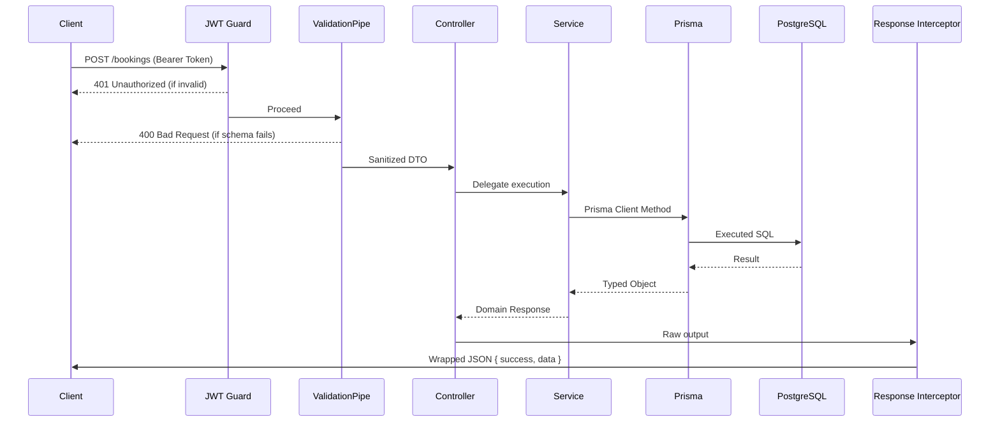

# Architecture Overview

The EN2H Booking Platform is a robust, production-ready backend system designed to handle service reservations. Built on **NestJS**, the application enforces a strict Domain-Driven, feature-module architecture. It utilizes **PostgreSQL** as the primary datastore, interfaced exclusively through the **Prisma ORM**.

The system is designed for high cohesion and low coupling. It prioritizes type safety, explicit dependency injection, and centralized error handling, ensuring that business logic is isolated and testable.

---

# High Level Architecture

The application is deployed via Docker and relies on a classic multi-tiered architecture.

---

# Project Structure

The repository is structured to separate configuration, domain boundaries, and shared infrastructure.

| Directory | Responsibility |
|-----------|----------------|
| `src/modules/` | Feature-based domains (Auth, Users, Services, Bookings). The core of the application. |
| `src/common/` | Global utilities applied across all modules (Interceptors, Filters, Decorators). |
| `src/config/` | Environment variables, Joi validation schemas, and configuration loaders. |
| `src/database/` | Prisma Client initialization, abstraction, and lifecycle management. |
| `prisma/` | Database schema (`schema.prisma`) and raw SQL migration tracking (`migrations/`). |
| `docs/` | ADRs, Business Rules, API Specs, and Development Logs. |
| `.github/workflows/`| Automated CI pipelines (compilation, testing). |
| `postman/` | Exported Postman collections and environments with automated test scripts. |

---

# Feature Modules

The application is decomposed vertically. Modules expose specific interfaces and do not cross-pollinate database access.

- **Authentication (`AuthModule`)**: Manages the issuance and validation of JSON Web Tokens. Integrates Passport strategies and handles token rotation flows.
- **Users (`UsersModule`)**: Manages identity records. Provides encapsulated methods for the Auth module to query users by email and persist hashed refresh tokens safely.
- **Services (`ServicesModule`)**: Manages the catalog of bookable offerings. Handles full CRUD and complex pagination/filtering queries.
- **Bookings (`BookingsModule`)**: The core domain engine. Handles reservations, enforces status transition rules, and relies on strict database constraints to prevent double-bookings.
- **Health (`HealthModule`)**: Exposes lightweight liveness probes (`/api/v1/health`) for container orchestrators.

---

# Shared Infrastructure

The shared layers ensure that cross-cutting concerns are handled uniformly.

- **ConfigModule**: Validates `process.env` against a strict Joi schema at boot. Fails fast if required variables (e.g., `DATABASE_URL`) are missing.
- **PrismaModule**: Exports the `PrismaService`. Guarantees a single, shared connection pool to PostgreSQL across the entire application runtime.
- **Exception Filters**: The `HttpExceptionFilter` catches all thrown exceptions (e.g., `NotFoundException`) and normalizes the payload to `{ success: false, statusCode: 404, error: "..." }`.
- **Interceptors**: The `ApiResponseInterceptor` intercepts successful controller responses and wraps them in a standardized `{ success: true, message: string, data: T }` envelope.
- **ValidationPipe**: Global pipe utilizing `class-validator`. Strips unexpected fields (`whitelist: true`) and rejects malformed payloads before they reach controllers.
- **Swagger**: Bound globally. Auto-generates the OpenAPI specification directly from controller routing and DTO decorators.
- **Dependency Injection**: Dependencies are wired strictly via constructor injection provided by the NestJS IoC container. No global singletons are manually instantiated.

---

# Request Lifecycle

Every HTTP request follows a strict path through the NestJS pipeline.

---

# Design Principles

- **Feature-based architecture**: Grouping logic by domain (Bookings, Auth) rather than technical type (Controllers, Services) maximizes cohesion and allows features to be easily extracted into microservices if needed.
- **Single Responsibility Principle (SRP)**: Controllers exclusively handle HTTP mapping; Services exclusively handle business logic; Prisma handles persistence.
- **Dependency Injection**: Services define what they need in their constructor. This allows for trivial mocking during unit tests (e.g., passing a `mockPrismaService`).
- **Configuration Separation**: Hardcoded values do not exist in the source code. Environments control behavior.

---

# Security Architecture

- **JWT (Stateless Access)**: API routes are protected by short-lived (15-minute) JWTs, preventing the need for a database lookup on every request.
- **Refresh Tokens (Stateful Session)**: Handled strictly. Refresh tokens are bcrypt-hashed before saving to the database. If a database is breached, active sessions cannot be stolen.
- **bcrypt**: Passwords are mathematically hashed with salting.
- **Validation**: Strict DTO mapping prevents prototype pollution and mass-assignment attacks by rejecting non-whitelisted payload properties.

---

# Deployment Architecture

The application is built for containerized deployment.

- **Docker**: The Node.js application is packaged inside a lean Alpine Linux container.
- **Docker Compose**: Orchestrates the local cluster. Spins up both the NestJS API (`port 3000`) and the PostgreSQL database (`port 5432`) simultaneously on an isolated bridge network.
- **GitHub Actions**: Provides CI verification. The `.github/workflows/ci.yml` triggers on `push` and `pull_request`, running dependency installation, Prisma generation, code compilation, and Jest unit tests with coverage reports.

---

# Future Scalability

The feature-based modularity guarantees that new business domains can be introduced safely. 

For example, to introduce a `Payments` feature:
1. Create a `PaymentsModule`.
2. Encapsulate all logic within that directory.
3. Import it into `AppModule`.

Because the existing `Bookings` and `Services` modules do not rely on a monolithic god-service, `Payments` can be integrated cleanly through explicit dependency injection without risking regressions in the core flow.
