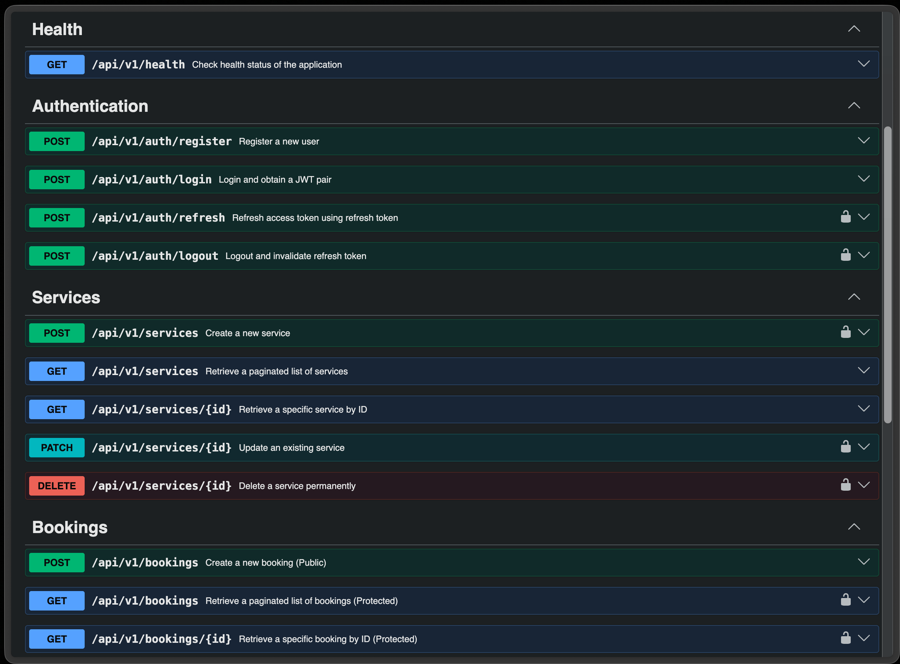
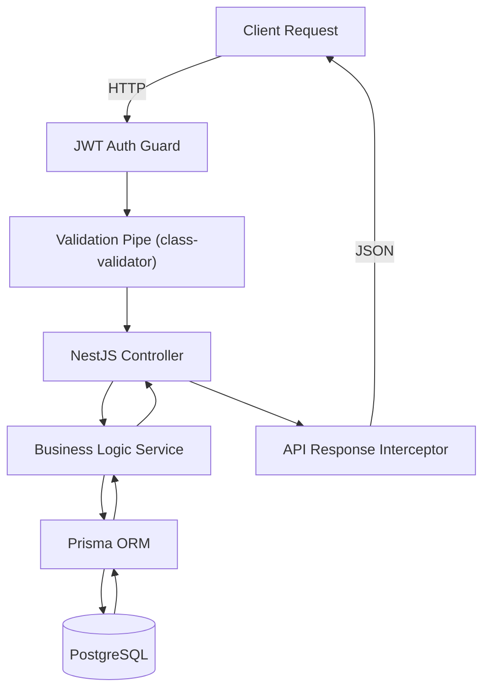
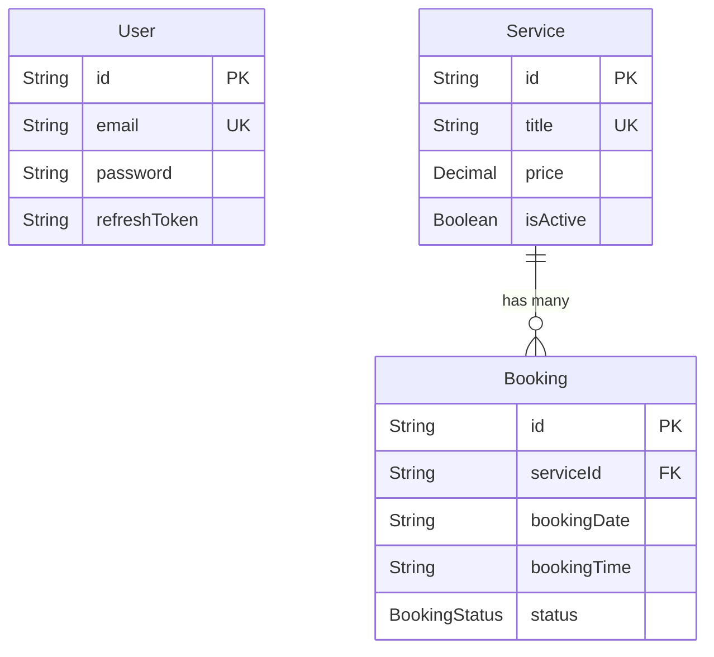
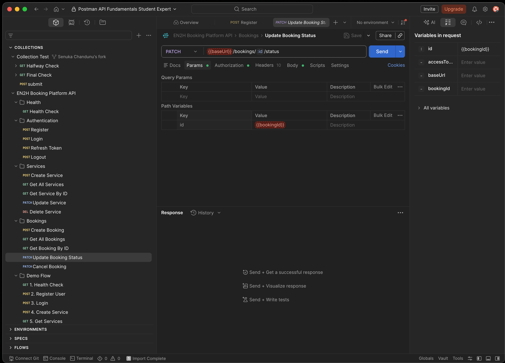
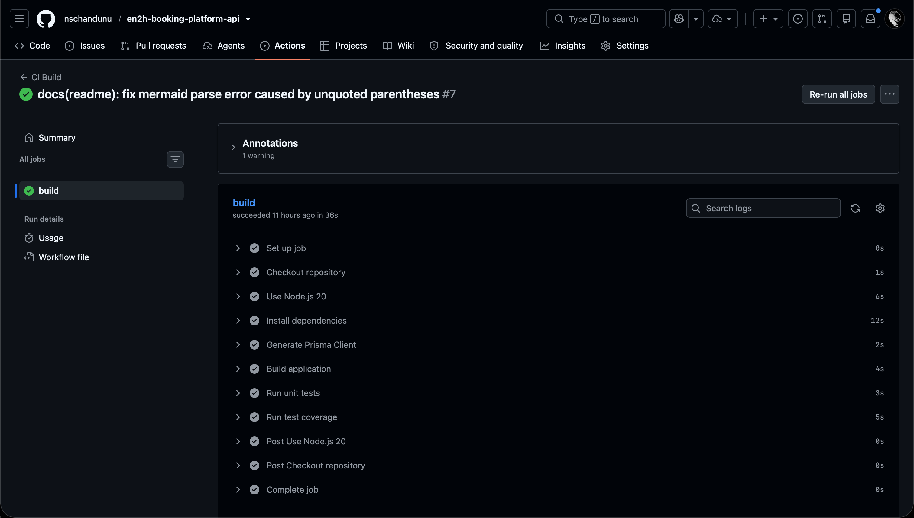

# EN2H Booking Platform API

[](#)
[](https://nestjs.com/)
[](https://www.prisma.io/)
[](https://www.postgresql.org/)
[](https://www.typescriptlang.org/)
[](#)

> *This project was developed as part of the EN2H Backend Engineering Internship Technical Assessment.*

## Project Overview

The **EN2H Booking Platform API** is a robust, production-ready RESTful backend designed to manage service catalogs and customer reservations. 

Built on a strict Domain-Driven Design (DDD) feature-module architecture, this API provides a highly secure, heavily tested, and fully containerized engine. Customers can seamlessly browse active services and book time slots, while the system natively guarantees data integrity and physically prevents double-bookings directly at the database engine level.

 


---

## Features

| Feature Category | Capabilities |
|-----------------|--------------|
| **Authentication** | Stateless JWT access tokens (15m), stateful Refresh Tokens (7d), Bcrypt hashing at rest, Token Rotation. |
| **Catalog Services** | Full CRUD, Cursor/Offset Pagination, Text Search (`?search=`), and Boolean Filtering (`?active=true`). |
| **Booking Engine** | State machine enforcement (`PENDING -> CONFIRMED`), Double-booking DB locks, Past-date rejection. |
| **Documentation** | Auto-generated Swagger OpenAPI spec, 1-click Postman Collections with automated test scripts. |
| **Operations** | Zero-config `docker-compose` cluster, GitHub Actions CI pipeline, Liveness Probes. |
| **Quality Assurance** | >95% Jest unit test coverage utilizing strictly mocked Dependency Injection. |

---

## Architecture

The system utilizes a multi-tiered architecture passing through strict validation layers before reaching the business logic.



---

## Tech Stack

| Layer | Technology | Purpose |
|-------|------------|---------|
| **Core Framework** | **NestJS (Node.js)** | Highly opinionated, IoC container, strictly-typed. |
| **Language** | **TypeScript** | End-to-end type safety from database to controller. |
| **Database** | **PostgreSQL** | ACID-compliant relational data storage. |
| **ORM** | **Prisma** | Declarative schema migrations and typed query building. |
| **Authentication** | **Passport (JWT)** | Secure, horizontally scalable session management. |
| **Testing** | **Jest** | Isolated unit testing and coverage reporting. |
| **Containerization**| **Docker** | Isolated environments via Alpine Linux images. |

---

## Folder Structure

The repository is structured to prioritize scalability and clear separation of concerns.

```text
src/
├── common/        # Global Interceptors, Filters, and Validation Pipes
├── config/        # Joi Environment Validation schemas
├── database/      # Prisma Service IoC encapsulation
├── modules/       # Domain-Driven Feature Modules
│   ├── auth/      # Registration, Login, Refresh, Logout
│   ├── bookings/  # Reservation State Machine
│   ├── health/    # Liveness Probes
│   ├── services/  # Catalog Management
│   └── users/     # Identity Management
└── main.ts        # Application Bootstrap
```

---

## Database Design

The relational schema is highly optimized with targeted `@@index` constraints and composite unique keys.



---

## API Modules

### Authentication
- `POST /api/v1/auth/register` - Create a new user identity (bcrypt hashing).
- `POST /api/v1/auth/login` - Authenticate and issue JWT pairs.
- `POST /api/v1/auth/refresh` - Rotate session tokens securely.
- `POST /api/v1/auth/logout` - Revoke token hashes.

### Services
- `POST /api/v1/services` - Create a new bookable service.
- `GET /api/v1/services` - Paginated catalog (`?limit=10&page=1&search=wash`).
- `GET /api/v1/services/:id` - Fetch details.
- `PATCH /api/v1/services/:id` - Update pricing or active status.
- `DELETE /api/v1/services/:id` - Soft/Hard delete offerings.

### Bookings
- `POST /api/v1/bookings` - Submit a reservation (public).
- `GET /api/v1/bookings` - Fetch reservations (`?status=PENDING`).
- `GET /api/v1/bookings/:id` - Fetch booking details.
- `PATCH /api/v1/bookings/:id/status` - Transition booking states.
- `PATCH /api/v1/bookings/:id/cancel` - Abort reservations.

### Health
- `GET /api/v1/health` - Docker/K8s liveness probe.

---

## Getting Started

### Prerequisites
- [Docker & Docker Compose](https://www.docker.com/) (Recommended)
- [Node.js v20+](https://nodejs.org/) (For local development)

### Environment Variables
Copy the `.env.example` file to create your local `.env`.
```bash
cp .env.example .env
```
*(The defaults are already perfectly configured for the Docker cluster).*

### 🐳 Running via Docker (Zero Config)
The fastest way to review the application is spinning up the entire cluster simultaneously.
```bash
docker compose up --build
```
- API is available at `http://localhost:3000/api/v1`
- PostgreSQL is available at `localhost:5432`

### 💻 Running Locally (Manual)
If you prefer running outside of Docker:
```bash
# 1. Install dependencies
npm ci

# 2. Start your own local PostgreSQL instance and update DATABASE_URL in .env

# 3. Apply Prisma migrations
npx prisma migrate dev

# 4. Start the server
npm run start:dev
```

---

## API Documentation

<details>
<summary><strong>Explore Swagger UI</strong></summary>

When the application is running, navigate to `http://localhost:3000/docs` to interact with the live Swagger OpenAPI specification.


</details>

<details>
<summary><strong>Explore Postman Collection</strong></summary>

A comprehensive `postman/EN2H_Booking_Platform.postman_collection.json` is included. 
It features a **Demo Flow** folder that automatically extracts JWT tokens and database IDs, allowing reviewers to test the entire application lifecycle top-to-bottom with a single click.


</details>

---

## Testing & Quality Assurance

The application logic is heavily tested utilizing Jest and mocked Dependency Injection to guarantee stability across edge cases.

```bash
# Run isolated unit tests
npm run test

# Run tests and generate coverage reports
npm run test:cov
```
*(Currently achieving >95% statement execution coverage across all core domain modules).*

---

## CI/CD Pipeline

The `.github/workflows/ci.yml` file guarantees branch stability. On every `push` to `main` or `dev`, GitHub Actions spins up an isolated Ubuntu runner to:
1. Compile TypeScript strict typings.
2. Generate the Prisma Client.
3. Execute the full Jest unit test suite.



---

## Extensive Documentation

This repository reads like a technical wiki. Dive deeper into the engineering thought process by exploring the `docs/` directory:

- [ARCHITECTURE.md](ARCHITECTURE.md) - Deep dive into high-level design and request lifecycles.
- [DECISIONS.md](docs/DECISIONS.md) - Architecture Decision Records (ADRs) explaining trade-offs.
- [BUSINESS_RULES.md](docs/BUSINESS_RULES.md) - Explicit domain logic constraints and state machines.
- [DATABASE.md](docs/DATABASE.md) - Schema design and optimization strategies.
- [API_SPEC.md](docs/API_SPEC.md) - Payload layouts and endpoint mapping.
- [PROJECT_PLAN.md](docs/PROJECT_PLAN.md) - The roadmap used to build this architecture.
- [DEVELOPMENT_LOG.md](docs/DEVELOPMENT_LOG.md) - Chronological evolution of the codebase.

---

## Engineering Decisions

*Why hashed refresh tokens instead of token families?*
While strict OAuth2 financial applications utilize Token Families to detect concurrent token theft, I chose to implement Bcrypt-hashed Refresh Tokens. This provided highly robust security (mitigating database breach vulnerabilities) while keeping the scope and complexity completely proportionate to the requirements of the assessment. 

*Why Prisma `Promise.all()` over sequential awaits?*
In the services `findAll` logic, offset pagination requires executing both a `.findMany()` and a `.count()`. Executing these sequentially doubles database latency. Utilizing `Promise.all()` parallelizes the I/O, drastically improving endpoint response times at scale.

---

## Future Improvements

If deployed to a true high-traffic production environment, I would consider the following upgrades:
- **Redis Caching**: Caching the `/services` catalog endpoint via `CacheInterceptor` since service offerings rarely change.
- **Rate Limiting**: Utilizing `@nestjs/throttler` to prevent brute-force attacks on the `/auth/login` endpoint.
- **Winston Logger**: Replacing the default NestJS logger with a JSON-formatted Winston logger to easily pipe logs into Datadog or ELK.

---

## Author
Developed by **Senuka Chandunu**.
- [GitHub Profile](https://github.com/nschandunu)