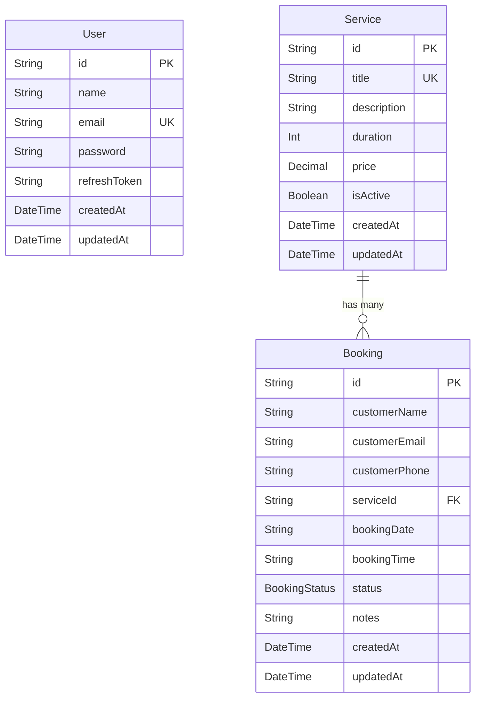

# Database Architecture

This document provides a comprehensive overview of the PostgreSQL database schema powering the EN2H Booking Platform, managed strictly through Prisma ORM.

## Database Overview
- **Engine**: PostgreSQL
- **ORM**: Prisma Client JS
- **Why PostgreSQL?**: Chosen for its robust ACID compliance, superior JSONB querying capabilities (if needed), and industry-standard reliability for financial/booking transactions.
- **Why Prisma?**: Chosen for its unmatched developer experience, type-safety across the full stack, and declarative schema approach which makes database migrations highly predictable and strictly version-controlled.

## Entity Relationship Diagram

---

## 1. User Model
Manages administrator authentication identities.

**Fields**:
- `id` (String): Primary Key, UUID auto-generated.
- `name` (String): Display name of the user.
- `email` (String): Unique email used for login.
- `password` (String): bcrypt hashed string (never plaintext).
- `refreshToken` (String?): bcrypt hashed string utilized for token rotation.
- `createdAt` / `updatedAt` (DateTime): Standard Prisma timestamps.

**Constraints & Indexes**:
- `@unique` on `email` to prevent duplicate account registrations.

---

## 2. Service Model
Represents the catalog of offerings that customers can book (e.g., "Premium Car Wash").

**Fields**:
- `id` (String): Primary Key, UUID.
- `title` (String): The name of the service.
- `description` (String): Detailed text describing the service.
- `duration` (Int): Time required in minutes.
- `price` (Decimal): The cost of the service.
- `isActive` (Boolean): Soft-delete / visibility flag (defaults to `true`).

**Relationships**:
- `bookings`: A `Service` can have zero or many `Booking` entities.

**Constraints & Indexes**:
- `@@unique([title])`: Ensures no duplicate service titles are created.
- `@@index([isActive])`: Optimized for filtering out inactive services from the public catalog.
- `@@index([title])`: Optimized for text-based searching (e.g., `?search=Car`).

---

## 3. Booking Model
The core domain model managing customer reservations against specific services.

**Fields**:
- `id` (String): Primary Key, UUID.
- `customerName` / `customerEmail` / `customerPhone` (String): Customer contact details.
- `serviceId` (String): Foreign key to the `Service` table.
- `bookingDate` (String): Stored as ISO date string (YYYY-MM-DD) for strict tz-agnostic comparisons.
- `bookingTime` (String): Stored as HH:MM format.
- `status` (BookingStatus): Enum representing the state machine.
- `notes` (String?): Optional customer requests.

**Booking Status Enum**:
- `PENDING`: Initial state upon creation.
- `CONFIRMED`: Acknowledged by an admin.
- `COMPLETED`: Service was successfully rendered.
- `CANCELLED`: The booking was aborted (cannot be reversed).

**Constraints & Indexes**:
- `@@unique([serviceId, bookingDate, bookingTime])`: **Critical Business Rule**. This composite unique constraint natively prevents double-bookings at the database engine level. It is physically impossible to book the exact same service at the exact same time.
- `@@index([status])`: Optimized for admin dashboards filtering `PENDING` bookings.
- `@@index([bookingDate])`: Optimized for calendar views querying specific date ranges.

---

## Database Migrations
All schema changes are tracked linearly in the `prisma/migrations/` directory. 
- During local development: `npx prisma migrate dev` creates and applies SQL diffs.
- During production / CI deployment: `npx prisma migrate deploy` ensures the remote PostgreSQL database schema matches the deployed application code without dropping tables.
